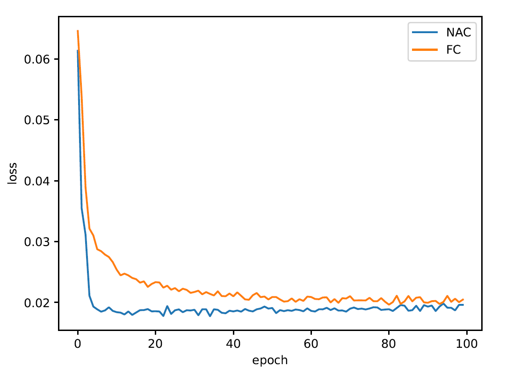

# Deep Learning on Computation Accelerators - Final Project on Neural Arithmetic Logic Units

This is a PyTorch implementation our project, the code is heavily based on [Kevin Zakka](https://github.com/kevinzakka/NALU-pytorch) implementation to [Neural Arithmetic Logic Units](https://arxiv.org/abs/1808.00508) by *Andrew Trask, Felix Hill, Scott Reed, Jack Rae, Chris Dyer and Phil Blunsom* and on [MNIST Convnets](https://github.com/pytorch/examples/blob/master/mnist) pytorch example.

<p align="center">
 
</p>

## API

```python
from models import *

python nac_project.py

```

## Experiments

Run:

```python
python readLogFile.py
```

This should generate the following plot:

<p align="center">
 
</p>


## Notes
